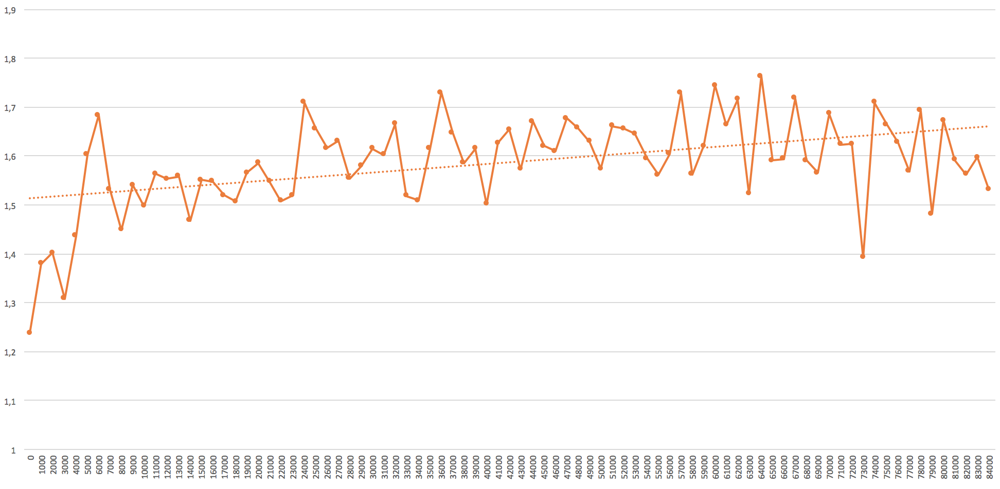

# CheckResearch.org [Experiment](https://checkresearch.org/Experiment/View/6d5e3599-59eb-410b-bf59-439a2f2c890c)

Publication ["Thou Shalt Not Depend on Me: Analysing the Use of Outdated JavaScript Libraries on the Web."](https://dblp.uni-trier.de/rec/html/conf/ndss/LauingerCA0WK17) by "Tobias Lauinger, Abdelberi Chaabane, Sajjad Arshad, William Robertson, Christo Wilson, Engin Kirda"

## Experiment Setup

### Experiment Content

Lauinger et al. showed that the number of tested websites using a JavaScript library with at least one known vulnerability was __37%__ in 2017. The paper focuses on causality trees to try to understand the reason why older versions are used. However, the high number of hosts with vulnerable libraries is reproducible without the reasoning from where or how the library is included.

Therefore, I focused on reproducing the number of websites with at least one known JavaScript library vulnerability. Lauinger et al. used static and dynamic detection of the libraries. Static detection consists of checking the hash value of a library file and dynamic detection uses an extractor function which is evaluated in the context of the website. I use dynamic detection because it guaranties that a library is loaded correctly, which is not the case if you just check for a hash value of a file. Another reason why I did not use static detection is that I did not find a large source of vulnerable JavaScript library versions represented as hash values. 

Furthermore, there is the blog post [77% of sites use at least one vulnerable JavaScript library](https://snyk.io/blog/77-percent-of-sites-use-vulnerable-js-libraries/) from [snyk](https://snyk.io) which claims that __76.6%__ of the Top 5000 Alexa websites use vulnerable JavaScript library versions. They did not release raw data, so it is hard to verify their rather high number. For crawling they used [WebPageTest](https://www.webpagetest.org) and for the source of vulnerable versions they used their own database.

### Hardware/Software

To crawl the web for uses of vulnerable JavaScript libraries, I developed custom software to do the necessary tasks. The software was written in [Python 3](https://www.python.org) and consists of two parts, the crawler and the analyzer. The crawler uses [Selenium](https://www.seleniumhq.org) and [Google Chrome](https://www.google.com/chrome/) to open websites, waits for the page to finish loading and then executes JavaScript extractors code to gather the version number of the embedded libraries. [Retire.js](https://retirejs.github.io/) was used as a source of the version extractors. Those code snippets were executed in a try-catch block to handle exceptions in case that the tested library is not included. I only made use of the function extractions because the other kinds (e.g. the filename, the file content, or a hash value of the file) are not available for every library. I also added additional extractor functions I found in an earlier crawler version. Furthermore, this made sure that the library is successfully loaded or not, for example, it is only present as static text anywhere on the page. 

Since the crawler will be running for a longer time period I added necessary exception handling to continue the process in case of errors, for example, if Google Chrome crashes or a timeout occurred. Furthermore, I made sure that log messages and partial results are written to the hard disk immediately and not buffered, such that in case of a crash no data is lost. At the startup of the crawler there is an option to set an offset for the list of websites in the case I want to continue the crawling process after a crash. 

The second part of the software is the analyzer, which is executed separately after the crawler was finished. It again uses [Retire.js](https://retirejs.github.io/) as a source of vulnerable JavaScript libraries. Every vulnerability entry has at least one of the parameters _atOrAbove_ or _below_. Unfortunately, entries exist which contain version numbers of beta or release candidate versions, which are not easily comparable with code. Therefore, I rewrote the version numbering manually. _below_ version numbers with additional version information were "rounded up" to next stable version number. For example,  _jQuery 1.9.0b1_ was rewritten to _1.9.0_, which was later released. However, this is not an error, because the analyzer checks for strictly lower and integer version numbers. Additional characters, like _b1_ in this case, are simple removed. This means _1.8.x_ would match the version and _1.9.0_ or _1.9.0b1_ not. Like this, _atOrAbove_ versions were rewritten, although beta or release candidate version for this parameter are much rarer.

The written software was executed on an [AWS](https://aws.amazon.com) EC2 t2.micro instance running [Ubuntu](https://www.ubuntu.com). Due to the small long time CPU performance, the timeout of a website to load was set to 45 seconds. Included in the data folder is a list of websites which did run into a timeout. A timeout occurs for some pages which never finish loading, at least for Selenium, because the page always loads some dynamic content. Another source of timeouts is the simple fact that the small AWS EC2 t2.micro instance is just not powerful enough to load the page within 45 seconds.  


## Experiment Assumptions

First, as a source for a list of popular websites I did use the [Alexa](https://www.alexa.com/topsites) Top 1M sites downloaded on May 3. Furthermore, I used the DNS Service and Internet connection provided by Amazon. Inside their cloud environment it is theoretically possible that some sites are blocked or modified during the transmission. I also set the URL to use plain HTTP, however redirects are followed during the experiment. I also relied on the assumption that the extracted version number is in fact the one used. It is theoretically possible that a wrong (older) version number is returned even when a newer is in use or a certain vulnerability is already patched. I also did use [Retire.js](https://retirejs.github.io/) as a source of extractor functions and list of vulnerable versions. I only used the extractor functions for the site itself and not for iframes. Finally, this work makes no predictions if a certain website is in fact vulnerable. Often vulnerabilities in JavaScript libraries are only exploitable in some edge case, therefore a conclusion of the exploitability is difficult. This experiment only checks for the version in use.

## Preconditions

* A list of websites is needed as input for the crawler. As already mentioned I did make use of the Alexa Top Sites list.
* You will also need to download a current version of the [Retire.js Repository](https://github.com/RetireJS/retire.js/blob/master/repository/jsrepository.json) and rewrite the parameters _atOrAbove_ and _below_ as explained in Experiment Setup.
* Google Chrome is installed on the machine which runs the crawler.

## Experiment Steps

To run the experiment I did the steps explained in the Preconditions on an [AWS](https://aws.amazon.com) EC2 t2.micro instance. In order to execute the code, it is recommended to create a virtual environment. In the virtual environment, the required packages can be installed with the [Python Package Index](https://pypi.org/project/pip/) (pip) and the _freeze.txt_ file, which is located in the _code_ subdirectory:
```
virtualenv -p python3 env
source env/bin/activate
cd code
pip install -r freeze.txt
```

I did use the following command to get the domain name from the Alexa file. The command only outputs the first 85,000 entries.
```
head -n 85000 top-1m.csv | cut -d, -f2 > ../data/list.txt
```

Then, I started the crawler python program in the background with an offset of 0:
```
nohup python crawler_retirejs.py 0 &
```

With the log file produced by the program it is possible to monitor the progress. The time it takes depends on the number of websites in the input list, the performance of the computer it is running on and the internet connection.

When it is finished or after a desired number of websites have been crawled (the crawler can be stopped at any time and resumed with an offset) the analyzer part comes into play. It outputs the results as a CSV file and can then be used to import the data in, for example, [Microsoft Excel](https://products.office.com/excel). The following command lets you run the analyzer:
```
python analyzer_retirejs.py > ../result/analyzer_result.csv
```

The result consists of a table with three columns: the rank, the domain name and the number of found vulnerabilities. With Excel I did further processing like grouping by rank and averaging, finding the correlation between rank and average number of vulnerabilities and creating the figure shown below. 

## Results

The process of crawling the websites took approximately 21 days. The crawler processed 85,000 websites, however 8.28% of them did time out, so there is no data from these websites. All results I calculated include the timeout websites as no libraries found there, therefore they do not have any number of vulnerabilities in the results.



I grouped the number of vulnerabilities per websites into groups of 1000 ranks and calculated the average number of vulnerabilities per website. The figure above shows this data. The X axis shows the rank groups, where, for example, group 0 contains all websites with from rank 1 to 1,000. The Y axis shows the average number of vulnerabilities detected in used JavaScript libraries per group. As you can see there is a [moderate positive](http://www.statstutor.ac.uk/resources/uploaded/pearsons.pdf) correlation (with r=0.46) between the rank of a website and the number of vulnerabilities. 

In the top 500 websites 217 of them use at least one library with one vulnerability. This is a percentage of __43.4%__. All in all, the total number of sites with at least one found vulnerability is 52,958, which are __62.3%__ of all 85k websites. The average number of vulnerabilities per website is __1.59__.

Finally, with the raw data included other interesting information could be generated, for example, the popularity of a certain (version of a) JavaScript library. However, this was not the main focus of this work.
